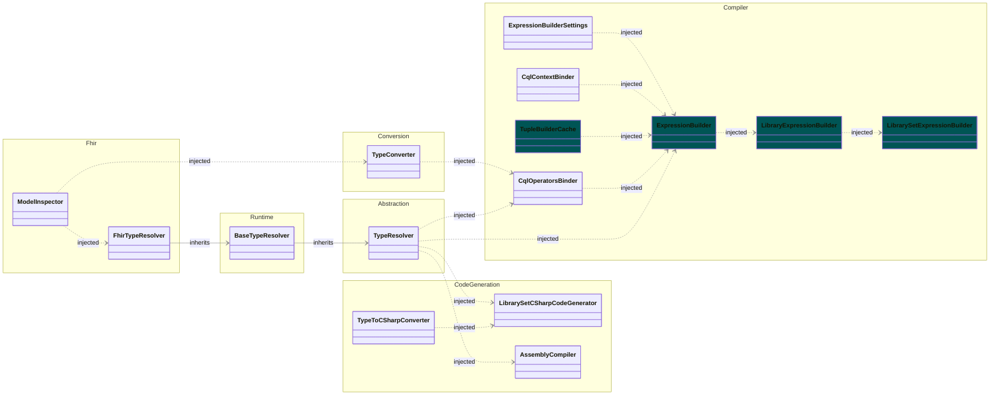
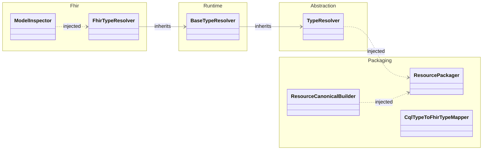
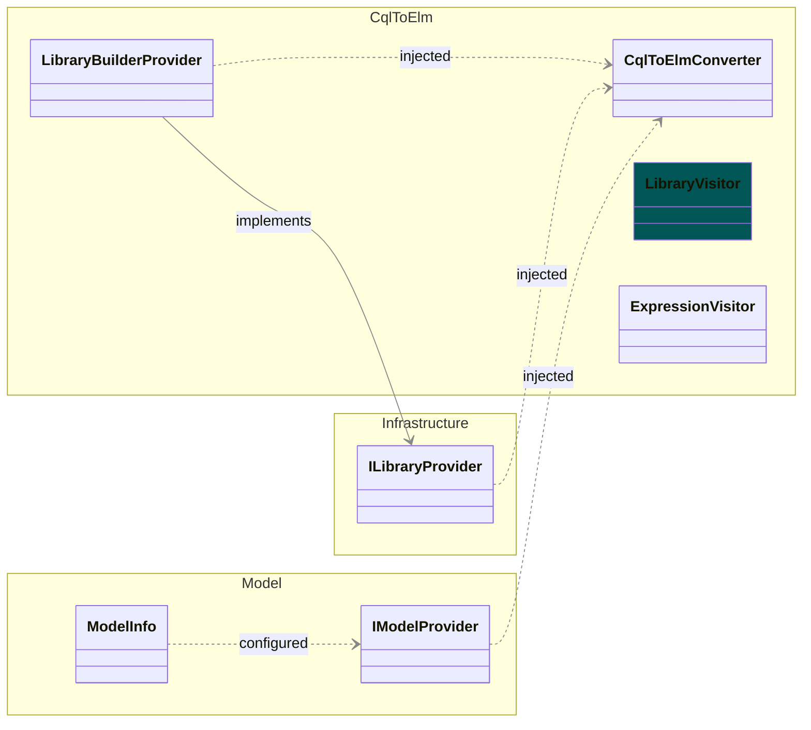

# Toolkit Services Dependency Diagrams
These diagrams represent the internal dependencies of the CQL SDK toolkit services.
They use mermaid syntax to visualize the relationships between various components of the CQL SDK.
For the best viewing experience, it is recommended to view these diagrams in the [online mermaid editor](https://www.mermaidchart.com/).

## ElmToolkitServices Dependency Diagram

Services for compiling ELM to C# code and .NET assemblies.

**Remarks:**
* Excludes Logger and Options for clarity
* Cyan classes indicate scoped services
* All others are singleton services
* Classes are grouped by their respective projects

## PackagingToolkitServices Dependency Diagram

Services for packaging CQL libraries as FHIR Library resources.

**Remarks:**
* Excludes Logger and Options for clarity
* All services are singleton services
* Classes are grouped by their respective projects

## CqlToolkitServices Dependency Diagram

Services for translating CQL to ELM format.

**Remarks:**
* Excludes Logger and Options for clarity
* All services are singleton services except LibraryVisitor which is scoped
* Classes are grouped by their respective projects

