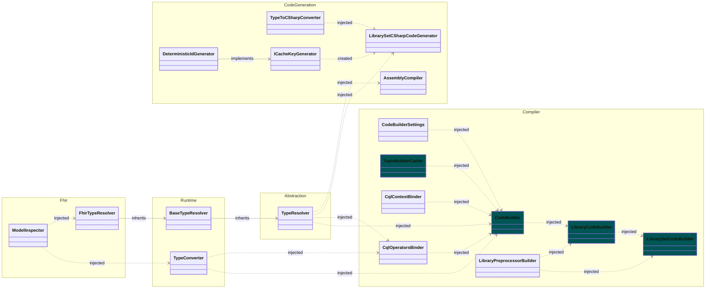
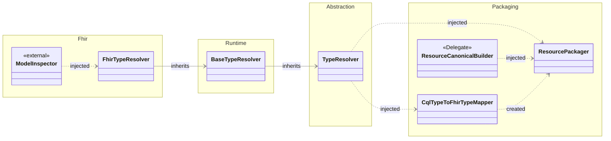
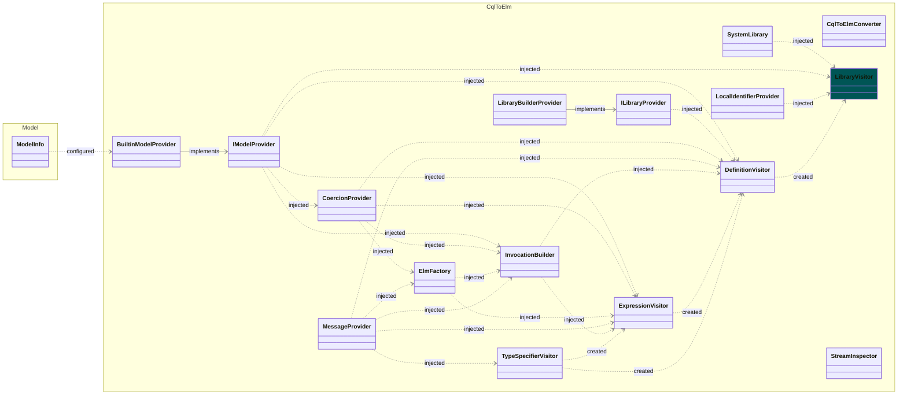

# Toolkit Services Dependency Diagrams
These diagrams represent the internal dependencies of the CQL SDK toolkit services.
They use mermaid syntax to visualize the relationships between various components of the CQL SDK.
For the best viewing experience, it is recommended to view these diagrams in the [online mermaid editor](https://www.mermaidchart.com/).

## ElmToolkitServices Dependency Diagram

Services for compiling ELM to C# code and .NET assemblies.

**Remarks:**
* Excludes Logger and Options for clarity
* Cyan classes indicate scoped services
* All others are singleton services
* Classes are grouped by their respective projects

```mermaid
%%{init: {
    'themeVariables':{  
      'lineColor': '#888',
      'lineWidth': 4
}}}%%

classDiagram

    direction LR

    namespace Compiler {
        class LibrarySetCodeBuilder { }    
        class LibraryCodeBuilder { }    
        class CodeBuilder { }    
        class CodeBuilderSettings { }    
        class TupleBuilderCache { }
        class CqlContextBinder { }
        class CqlOperatorsBinder { }       
        class LibraryPreprocessorBuilder { }
    }

    namespace CodeGeneration {
        class TypeToCSharpConverter { }
        class LibrarySetCSharpCodeGenerator { }
        class AssemblyCompiler { }
        class ICacheKeyGenerator { }
        class DeterministicIdGenerator { }
    }

    namespace Abstraction {
        class TypeResolver { }
    }

    namespace Runtime {
        class BaseTypeResolver { }
        class TypeConverter { }
    }

    namespace Fhir {
        class FhirTypeResolver { }
        class ModelInspector { }
    }

    %% Style Scoped Types as Cyan
    style LibrarySetCodeBuilder fill:#055
    style LibraryCodeBuilder fill:#055
    style CodeBuilder fill:#055
    style TupleBuilderCache fill:#055
    
    %% Inheritance  
    BaseTypeResolver --> TypeResolver : inherits
    FhirTypeResolver --> BaseTypeResolver : inherits
    DeterministicIdGenerator --> ICacheKeyGenerator : implements
    
    %% Dependencies                                                 
    LibraryCodeBuilder ..> LibrarySetCodeBuilder : injected
    LibraryPreprocessorBuilder ..> LibrarySetCodeBuilder : injected
    CodeBuilder ..> LibraryCodeBuilder : injected
    LibraryPreprocessorBuilder ..> LibraryCodeBuilder : injected

    TypeResolver ..> CodeBuilder : injected
    CqlOperatorsBinder ..> CodeBuilder : injected
    TupleBuilderCache ..> CodeBuilder : injected
    CqlContextBinder ..> CodeBuilder : injected
    CodeBuilderSettings ..> CodeBuilder : injected
    TypeConverter ..> CodeBuilder : injected

    TypeResolver ..> CqlOperatorsBinder : injected
    TypeConverter ..> CqlOperatorsBinder : injected

    ModelInspector ..> TypeConverter : injected  
    ModelInspector ..> FhirTypeResolver : injected  

    TypeToCSharpConverter ..> LibrarySetCSharpCodeGenerator : injected
    TypeResolver ..> LibrarySetCSharpCodeGenerator : injected
    ICacheKeyGenerator ..> LibrarySetCSharpCodeGenerator : created

    TypeResolver ..> AssemblyCompiler : injected
```

## PackagingToolkitServices Dependency Diagram

Services for packaging CQL libraries as FHIR Library resources.

**Remarks:**
* Excludes Logger and Options for clarity
* All services are singleton services
* Classes are grouped by their respective projects
* `ResourceCanonicalBuilder` is a delegate, not a class — shown as a class here only for diagram simplicity
* `CqlTypeToFhirTypeMapper` is registered in this container but is never DI-injected anywhere; `ResourcePackager` builds its own instance manually from its injected `TypeResolver`
* `ModelInspector` is an external type from the Firely .NET SDK (`Hl7.Fhir.Introspection`), not source declared in this repo

```mermaid
%%{init: {
    'themeVariables':{  
      'lineColor': '#888',
      'lineWidth': 4
}}}%%

classDiagram

    direction LR

    namespace Packaging {
        class ResourcePackager { }
        class ResourceCanonicalBuilder {
            <<Delegate>>
        }
        class CqlTypeToFhirTypeMapper { }
    }

    namespace Abstraction {
        class TypeResolver { }
    }

    namespace Runtime {
        class BaseTypeResolver { }
    }

    namespace Fhir {
        class FhirTypeResolver { }
        class ModelInspector {
            <<external>>
        }
    }

    %% Inheritance  
    BaseTypeResolver --> TypeResolver : inherits
    FhirTypeResolver --> BaseTypeResolver : inherits
    
    %% Dependencies                                                 
    TypeResolver ..> ResourcePackager : injected
    ResourceCanonicalBuilder ..> ResourcePackager : injected
    TypeResolver ..> CqlTypeToFhirTypeMapper : injected
    CqlTypeToFhirTypeMapper ..> ResourcePackager : created
    
    ModelInspector ..> FhirTypeResolver : injected
```

## CqlToolkitServices Dependency Diagram

Services for translating CQL to ELM format.

**Remarks:**
* Excludes Logger and Options for clarity
* All services are singleton services except `LibraryVisitor` (scoped); `LibraryVisitor.DefinitionVisitor`, `ExpressionVisitor` and `TypeSpecifierVisitor` (transient factories, created per-`LibraryBuilder` via a `Func<LibraryBuilder, T>` factory delegate); and `LocalIdentifierProvider` (plain transient)
* Classes are grouped by their respective projects
* `DefinitionVisitor` below is the nested class `LibraryVisitor.DefinitionVisitor`
* `BuiltinModelProvider` is the concrete `IModelProvider` implementation actually registered by this toolkit

```mermaid
%%{init: {
    'themeVariables':{  
      'lineColor': '#888',
      'lineWidth': 4
}}}%%

classDiagram

    direction LR

    namespace CqlToElm {
        class CqlToElmConverter { }
        class LibraryBuilderProvider { }
        class LibraryVisitor { }
        class DefinitionVisitor { }
        class ExpressionVisitor { }
        class TypeSpecifierVisitor { }
        class ILibraryProvider { }
        class IModelProvider { }
        class CoercionProvider { }
        class ElmFactory { }
        class SystemLibrary { }
        class StreamInspector { }
        class InvocationBuilder { }
        class LocalIdentifierProvider { }
        class MessageProvider { }
        class BuiltinModelProvider { }
    }

    namespace Model {
        class ModelInfo { }
    }

    %% Style Scoped Types as Cyan
    style LibraryVisitor fill:#055

    %% Inheritance / implements
    BuiltinModelProvider --> IModelProvider : implements
    LibraryBuilderProvider --> ILibraryProvider : implements

    %% Dependencies (injected)                                                 
    SystemLibrary ..> LibraryVisitor : injected
    IModelProvider ..> LibraryVisitor : injected
    LocalIdentifierProvider ..> LibraryVisitor : injected

    IModelProvider ..> DefinitionVisitor : injected
    ILibraryProvider ..> DefinitionVisitor : injected
    CoercionProvider ..> DefinitionVisitor : injected
    MessageProvider ..> DefinitionVisitor : injected
    InvocationBuilder ..> DefinitionVisitor : injected

    IModelProvider ..> ExpressionVisitor : injected
    CoercionProvider ..> ExpressionVisitor : injected
    ElmFactory ..> ExpressionVisitor : injected
    MessageProvider ..> ExpressionVisitor : injected
    InvocationBuilder ..> ExpressionVisitor : injected

    MessageProvider ..> TypeSpecifierVisitor : injected

    IModelProvider ..> InvocationBuilder : injected
    CoercionProvider ..> InvocationBuilder : injected
    ElmFactory ..> InvocationBuilder : injected
    MessageProvider ..> InvocationBuilder : injected

    IModelProvider ..> CoercionProvider : injected

    CoercionProvider ..> ElmFactory : injected
    MessageProvider ..> ElmFactory : injected

    %% Dependencies (factory-created per LibraryBuilder)
    DefinitionVisitor ..> LibraryVisitor : created
    ExpressionVisitor ..> DefinitionVisitor : created
    TypeSpecifierVisitor ..> DefinitionVisitor : created
    TypeSpecifierVisitor ..> ExpressionVisitor : created

    %% Configuration
    ModelInfo ..> BuiltinModelProvider : configured
```
