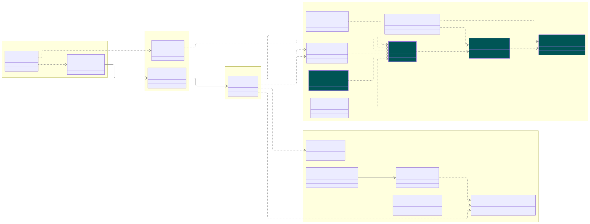
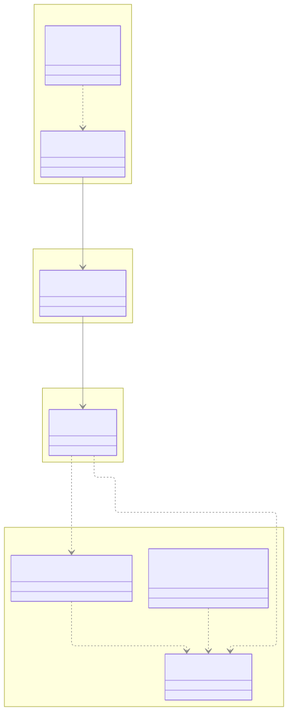
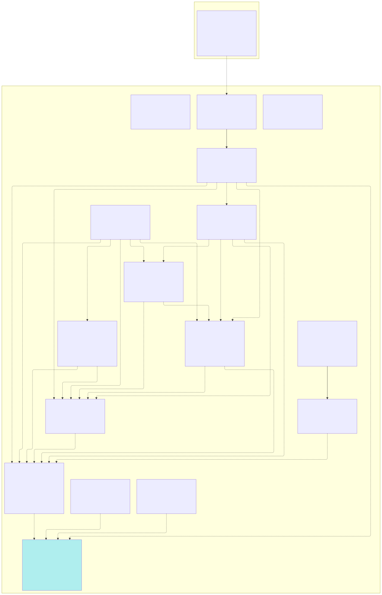
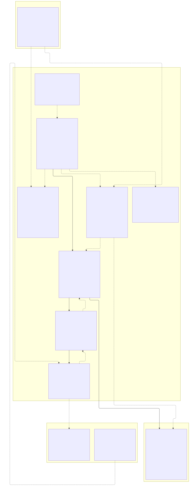
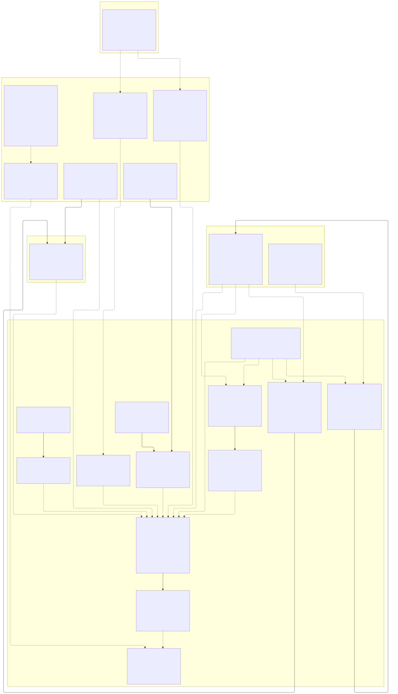
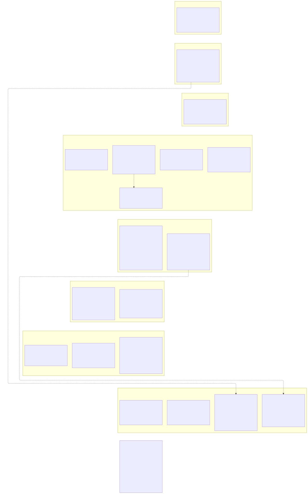

# Toolkit Services Dependency Diagrams
These diagrams represent the internal dependencies of the CQL SDK toolkit services, plus one
structural diagram of the code-model IR (not a dependency graph — see its own section below).

Each diagram is authored as a Mermaid flowchart (grouped into `subgraph` boxes per project, with each
type shown as a title + one-line description) and rendered to a `.svg` ahead of time (see
[tools/mermaid/](../tools/mermaid/)) rather than relying on GitHub's inline Mermaid renderer, which
does not reliably support every Mermaid feature used here (`subgraph` grouping, HTML node labels,
multi-target `style` directives). If you edit a diagram, edit its `.mmd` source file and regenerate
the `.svg` — see [tools/mermaid/README.md](../tools/mermaid/README.md).

## ElmToolkitServices Dependency Diagram

Services for compiling ELM to C# code and .NET assemblies.

**Remarks:**
* Excludes Logger and Options for clarity
* Cyan classes indicate scoped services
* All others are singleton services
* Classes are grouped by their respective projects

Mermaid source: [dependency-diagrams.elm-toolkit-services.mmd](diagrams/dependency-diagrams.elm-toolkit-services.mmd)

## PackagingToolkitServices Dependency Diagram

Services for packaging CQL libraries as FHIR Library resources.

**Remarks:**
* Excludes Logger and Options for clarity
* All services are singleton services
* Classes are grouped by their respective projects
* `ResourceCanonicalBuilder` is a delegate, not a class — shown as a class here only for diagram simplicity
* `CqlTypeToFhirTypeMapper` is registered in this container but is never DI-injected anywhere; `ResourcePackager` builds its own instance manually from its injected `TypeResolver`
* `ModelInspector` is an external type from the Firely .NET SDK (`Hl7.Fhir.Introspection`), not source declared in this repo

Mermaid source: [dependency-diagrams.packaging-toolkit-services.mmd](diagrams/dependency-diagrams.packaging-toolkit-services.mmd)

## CqlToolkitServices Dependency Diagram

Services for translating CQL to ELM format.

**Remarks:**
* Excludes Logger and Options for clarity
* All services are singleton services except `LibraryVisitor` (scoped); `LibraryVisitor.DefinitionVisitor`, `ExpressionVisitor` and `TypeSpecifierVisitor` (transient factories, created per-`LibraryBuilder` via a `Func<LibraryBuilder, T>` factory delegate); and `LocalIdentifierProvider` (plain transient)
* Classes are grouped by their respective projects
* `DefinitionVisitor` below is the nested class `LibraryVisitor.DefinitionVisitor`
* `BuiltinModelProvider` is the concrete `IModelProvider` implementation actually registered by this toolkit

Mermaid source: [dependency-diagrams.cql-toolkit-services.mmd](diagrams/dependency-diagrams.cql-toolkit-services.mmd)

## InvocationToolkit Services Dependency Diagram

Construction and ownership flow for loading generated CQL assemblies and invoking their definitions,
including the opt-in `LibrarySetInvokerPool`.

**Remarks:**
* `InvocationToolkit` is the only toolkit without an internal DI container, so — like the runtime diagram below — this graph shows construction and ownership wiring rather than container registrations
* Pooling is opt-in: without a `LibrarySetInvokerPool`, `InvocationToolkit.CreateLibrarySetInvoker` creates a fresh collectible `AssemblyLoadContext` and reloads every assembly on each call
* Solid edges are ownership/containment, dashed edges are creation, configuration or per-call flow
* The `back-references` edges are drawn deliberately: they are why retaining a `LibraryInvoker` or `DefinitionInvoker` keeps a whole assembly load context alive, which is the one way a consumer can defeat the pool
* `LibrarySetInvokerPoolKey` is internal, and is shown because the content hash it derives is what makes pooling work across separately-built toolkits
* No scoped-vs-singleton color convention is applied here, for the same reason as the runtime diagram below

Mermaid source: [dependency-diagrams.invocation-toolkit-services.mmd](diagrams/dependency-diagrams.invocation-toolkit-services.mmd)

## Runtime Services Dependency Diagram

Services and construction flow for CQL runtime evaluation in the FHIR binding (`FhirCqlContext`).

**Remarks:**
* Unlike the three DI-container toolkit diagrams above (`ElmToolkitServices`, `PackagingToolkitServices`, `CqlToolkitServices`), this layer is not represented by a DI container registration class; the graph shows factory-time construction and injection wiring from `FhirCqlContext.CreateOperators`
* Excludes Logger and options members not used for runtime operator construction
* The diagram highlights `FhirCqlContextOptions.MetricService` (`IMetricService`) and the default fallback path via `UcumConversionExtensions.Default`/`DefaultUcumMetricService`
* No scoped-vs-singleton color convention is applied here because lifetime is a mix of per-context construction and static defaults rather than explicit container scopes

Mermaid source: [dependency-diagrams.runtime-services.mmd](diagrams/dependency-diagrams.runtime-services.mmd)

## CodeModel Expression Types

The `Hl7.Cql.Compiler.CodeModel` types that make up the typed C# code-model IR (intermediate
representation) built by `CodeBuilder` and printed to C# source by the emitter — see
[cql-engine-architecture.md](cql-engine-architecture.md) for where this fits in the overall
CQL→ELM→C#→assembly pipeline.

**Remarks:**
* Unlike the toolkit-service diagrams above (DI dependency graphs), this shows structural composition — which node types exist and what kind of child expressions they hold
* Grouped by conceptual category, not by project — every type here lives in `Hl7.Cql.Compiler.CodeModel`
* All 19 concrete types inherit directly from the abstract `CodeExpression` base (not drawn as 19 identical edges — noted on the `CodeExpression` card instead)
* Every "child expression" slot named in a card's description is typed as the abstract `CodeExpression` base, so any of the 19 concrete types may appear there — only the few relationships that require one *specific* concrete type are drawn as edges
* Excludes `CodeExpressionExtensions` and `CodeTypeRules` (static helper/validation utilities, not IR node types)

Mermaid source: [dependency-diagrams.codemodel-expressions.mmd](diagrams/dependency-diagrams.codemodel-expressions.mmd)

