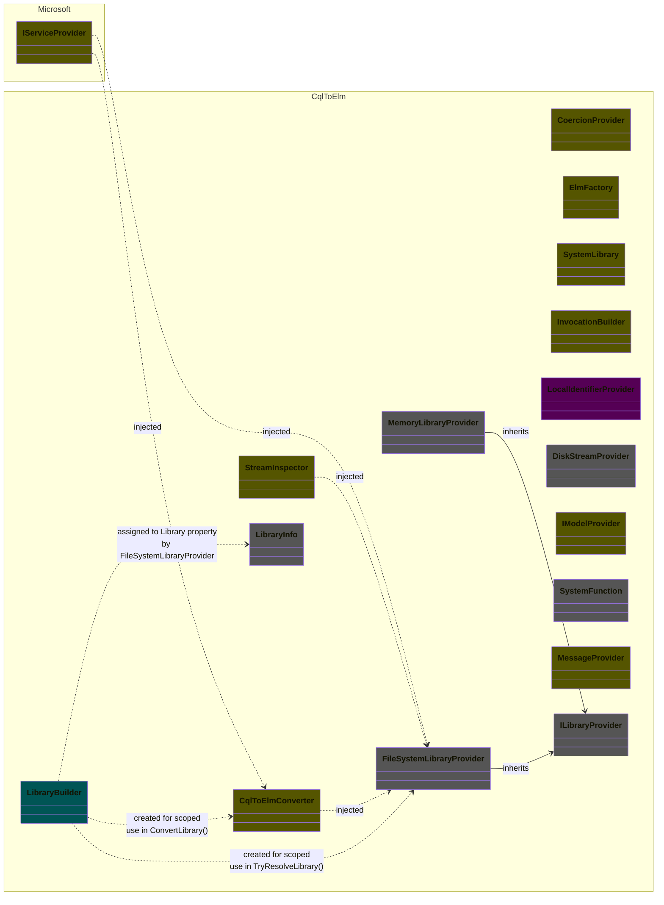
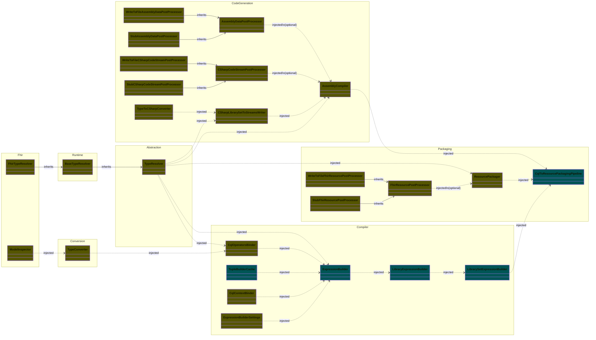

# Service Dependency Graphs

## Table of Contents
1. [CQL to ELM](#h2-cql-to-elm)
1. [CQL Packager SDK (with dependencies: Code Generation and Compiler)](#h2-cql-packager)

## CQL to ELM

Remarks
* Excl Logger and Options
* Cyan classes indicate scoped services
* Purple classes indicate transient services
* Gray classes indicate types not registered by the service provider
* Brown classes indicate singleton services
* Classes are group by their respective projects
* Code Smells
  * `IServiceProvider` must not be used directly in the code
  * Scoped services leak out of the scope into data objects e.g. `LibraryBuilder` into `LibraryInfo`
  * Services leak out their dependencies by making them public properties e.g.
    * `LibraryBuilder` exposes `FileSystemLibraryProvider`
    * `LibraryInfo` exposes `LibraryBuilder library`
    * `CqlToElmConverter` exposes `IServiceProvider Services`, `ILogger<CqlToElmConverter> Logger`
  * `CqlToElmConverter` is also a factory for `LibraryBuilder`, see `GetBuilder` method

 
## CQL Packager SDK (with dependencies: Code Generation and Compiler)

Remarks
* Excl Logger and Options
* Cyan classes indicate scoped services
* Brown classes indicate singleton services
* Classes are group by their respective projects

