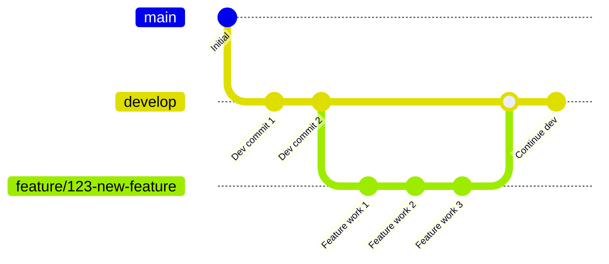
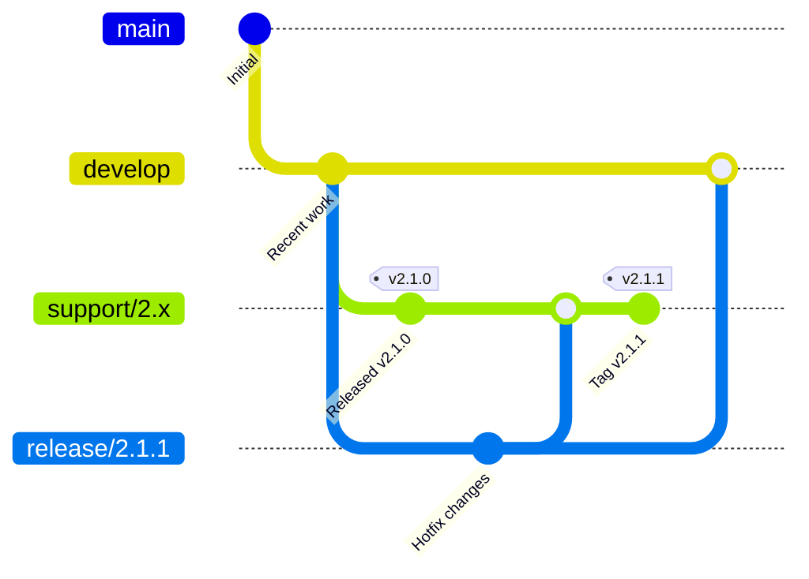
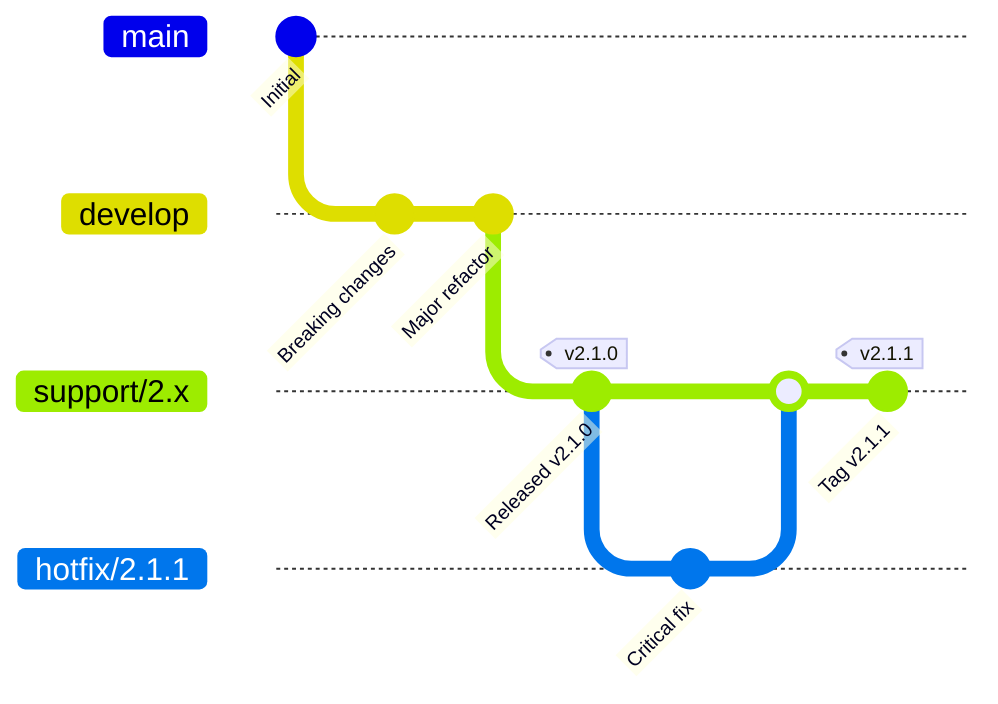
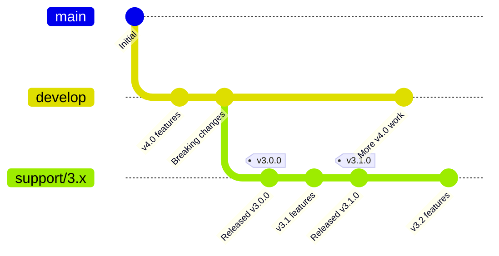

# Git Branching and Flow Guidelines

**Document Version:** 1.0  
**Effective Date:** January 2025  

## Overview

This document establishes the official Firely git branching strategy and workflow guidelines. These guidelines ensure consistent development practices, clear release management, and efficient collaboration across the team.

**Scope:** These guidelines apply primarily to Firely Server and Firely Auth projects. For SDK projects, simplified workflows may be more appropriate depending on the project's specific requirements.

## Branching Strategy

### Core Philosophy

Firely's branching strategy is based on **Gitflow** with modifications to support multiple active releases and long-term maintenance requirements. This approach recognizes that:

- Features can be complex and require stabilization before release
- Multiple released versions need simultaneous support
- Releases are planned and coordinated rather than continuous
- Careful testing and quality assurance are essential

### Branch Structure

#### Long-Lived Branches

1. **`develop`** - Main development branch
   - Contains the latest features for the next major release
   - All new feature development starts from this branch
   - Protected branch with required PR reviews

2. **`support/X.x`** - Version support branches (e.g., `support/2.x`, `support/3.x`)
   - Created immediately when a major version is released
   - Used for ongoing maintenance and minor releases of released versions
   - Contains all tags for that major version
   - Protected branches with required PR reviews

#### Short-Lived Branches

1. **Feature branches** - `feature/issue-number-feature-name` or `feature/issue-number`
   - Created from `develop` for new features
   - Merged back to `develop` via pull request
   - Deleted after successful merge

2. **Release branches** - `release/X.Y.Z`
   - Created from `develop` or appropriate support branch
   - Used for final testing and stabilization
   - Merged to support branch and back to source branch
   - Deleted after release completion

3. **Hotfix branches** - `hotfix/X.Y.Z`
   - Created for urgent fixes to released versions
   - Source branch determined by hotfix strategy (see below)
   - Merged back to source branch and forward-ported as needed

## Workflow Procedures

### Feature Development

1. **Start new feature:**
   ```bash
   git checkout develop
   git pull origin develop
   git checkout -b feature/your-feature-name
   ```

2. **Complete feature:**
   - Create pull request against `develop`
   - Ensure all tests pass and code review is completed
   - Merge using "Squash and merge" strategy *(applies to Firely Server and Auth)*
   - Delete feature branch after merge *(applies to Firely Server and Auth)*

#### Feature Development Flow



### Release Process

1. **Prepare release:**
   ```bash
   git checkout develop  # or appropriate support branch
   git pull origin develop
   git checkout -b release/X.Y.Z
   ```

2. **Finalize release:**
   - Perform final testing and bug fixes on release branch
   - Update version numbers and changelogs
   - Create pull request to merge into appropriate support branch
   - Tag the merge commit with version number
   - Merge release branch back to source branch if needed
   - Delete release branch

#### Release Process Flow

```mermaid
gitGraph
    commit id: "Initial"
    branch develop
    commit id: "Dev work"
    commit id: "Ready for release"
    branch release/2.1.0
    commit id: "Version bump"
    commit id: "Bug fixes"
    branch support/2.x
    merge release/2.1.0
    commit id: "Tag v2.1.0" tag: "v2.1.0"
    checkout develop
    merge release/2.1.0
    commit id: "Continue dev"
```

### Hotfix Strategy

#### For Latest Minor Version

**Preferred Approach: Fork from develop**
- Incorporate fix directly in `develop` for next release
- If urgent release needed, create `release/X.Y.Z` branch from `develop`

#### Hotfix Flow (from develop)



**Alternative Approach: Fork from tag**
- Start from specific version tag when develop approach not feasible
- May require cherry-picking or rework due to pipeline/dependency changes
- Use when develop has diverged significantly from released version

#### Hotfix Flow (from tag)



#### Decision Criteria
- **Use develop approach when:**
  - Fix can wait for next planned release
  - Develop branch hasn't diverged significantly
  - Build/deployment infrastructure is compatible

- **Use tag approach when:**
  - Urgent hotfix cannot wait for next release
  - Develop has breaking changes not ready for release
  - Risk assessment favors isolated fix

### Concurrent Major Development

When developing the next major version while maintaining current major:

- **`develop`** - Dedicated to next major version development
- **`support/X.x`** - Used for ongoing current major development

**Example:**
- `develop` - Working on version 4.0 features
- `support/3.x` - Continuing 3.x minor releases (3.1, 3.2, etc.)

#### Concurrent Major Development Flow



## Branch Protection Rules

### Required Settings

All long-lived branches (`develop`, `support/X.x`) must have:

- **Require pull request reviews** (minimum 1 reviewer)
- **Require status checks to pass** (CI/CD pipelines)
- **Require branches to be up to date** before merging
- **Include administrators** in protection rules
- **Restrict pushes** to administrators only

### Merge Strategies

- **Feature branches → develop**: Squash and merge
- **Release branches → support branches**: Create merge commit
- **Hotfix branches**: Match target branch merge strategy

## Tagging Convention

### Tag Format
- **Release tags**: `vX.Y.Z` (e.g., `v3.1.0`, `v3.1.1`)
- **Pre-release tags**: `vX.Y.Z-alpha.N`, `vX.Y.Z-beta.N`, `vX.Y.Z-rc.N`

### Tag Placement
- All version tags must be placed on support branches (`support/X.x`)
- Tags mark the exact commit that represents the released version
- Create annotated tags with release notes

## Best Practices

### Commit Guidelines
- Use clear, descriptive commit messages
- Reference issue numbers when applicable
- Keep commits focused and atomic
- Follow conventional commit format when possible

### Branch Naming
- Use lowercase with hyphens for separation
- Include issue numbers when applicable
- Be descriptive but concise

### Code Review
- All changes require peer review before merge
- Review for code quality, testing, and documentation
- Ensure compliance with coding standards

### Documentation
- Update relevant documentation with feature changes
- Maintain changelog for each release
- Document breaking changes clearly

## Migration and Adoption

### Transitioning Existing Work
- Complete in-progress features on current branches before adopting new strategy
- Migrate existing feature branches to new naming convention gradually
- Update local development environments to track new branch structure

### Team Communication
- Announce strategy changes with adequate notice
- Provide training on new workflow procedures
- Maintain support during transition period

## Emergency Procedures

### Rollback Strategy
- Maintain ability to quickly revert problematic releases
- Use support branches to create emergency hotfix releases
- Document incident response procedures

### Contact Information
- Designate branch administrators for emergency access
- Maintain escalation procedures for critical issues
- Ensure 24/7 availability during major releases

---

**Questions or Clarifications?**  
Contact the development team or repository administrators for guidance on implementing these guidelines.