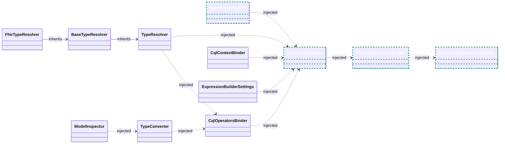
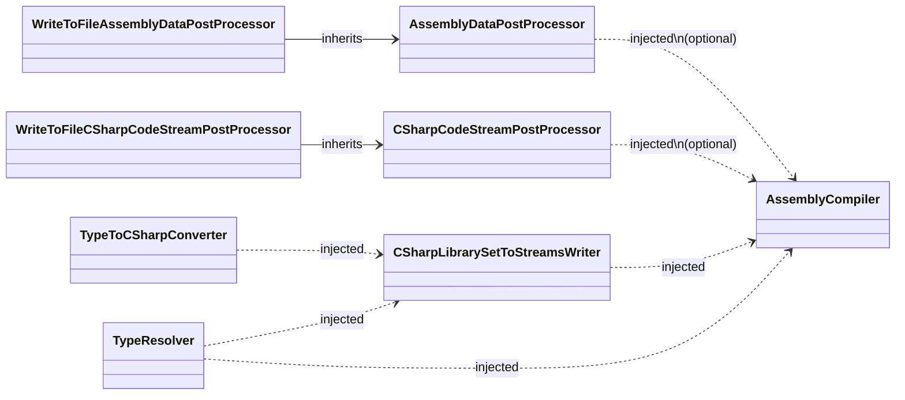
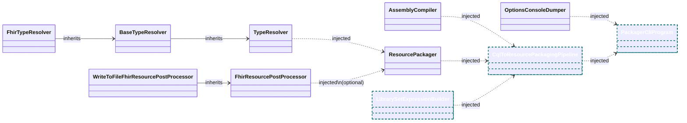

# PackagerCLI Diagrams
The diagram is split into two, the first one showing the high-level dependencies for the application, and the second the detailed dependencies for expression building.

### Cql Compiler Service Dependencies

Remarks
* Excl Logger and Options
* Cyan dotted outline classes indicate scoped services
* All others are singleton services

### Cql Code Generation Service Dependencies

Remarks
* Excl Logger and Options
* Cyan dotted outline classes indicate scoped services
* All others are singleton services

### Cql Packager Service Dependencies

Remarks
* Excl Logger and Options
* Cyan dotted outline classes indicate scoped services
* All others are singleton services

