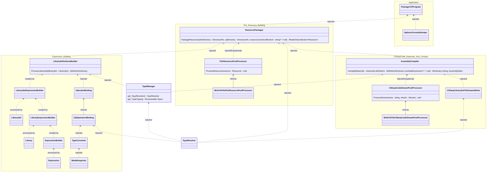
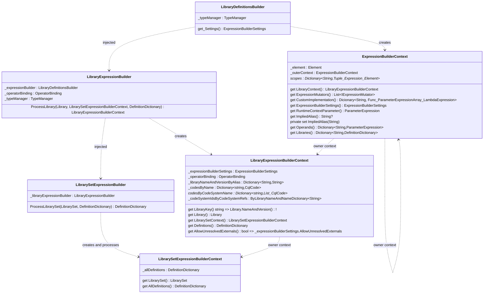

# PackagerCLI

## Service Dependencies (excl Logger and Options)

```mermaid
classDiagram
    direction BT

    %% HACK: Mermaid doesnt support commas withing generic, so use a similar looking character (﹐)

    class TypeManager {
        get_TypeResolver() TypeResolver
        get_TupleTypes() IEnumerable~Type~
    }

    namespace CSharpCode_Generate_And_Compile {
        class AssemblyCompiler {
            Compile(librarySet : LibrarySet,definitions : DefinitionDictionary~LambdaExpression~? = null) IDictionary~string, AssemblyData~
        }

        class CSharpLibrarySetToStreamsWriter {
        }

        class CSharpCodeStreamPostProcessor {
            ProcessStream(name : string, stream : Stream) void
        }

        class WriteToFileCSharpCodeStreamPostProcessor {
        }
    }

    namespace Expression_Building {
        class Expression{
        }

        class Library{
        }

        class LibrarySet{
        }

        class ExpressionBuilder{
        }

        class LibraryExpressionBuilder{
        }

        class LibrarySetExpressionBuilder{
        }

        class LibraryDefinitionsBuilder {
            ProcessLibrarySet(librarySet : LibrarySet) DefinitionDictionary<LambdaExpression>
        }

        class OperatorBinding {
        }

        class CqlOperatorsBinding {
        }

        class TypeConverter {
        }

        class ModelInspector {
        }
    }

    namespace Fhir_Resource_Building {
        class ResourcePackager {
            PackageResources(elmDirectory : DirectoryInfo, cqlDirectory : DirectoryInfo, resourceCanonicalRootUrl : string? = null) IReadOnlyCollection~Resource~
        }

        class FhirResourcePostProcessor {
            ProcessResource(resource : Resource) void
        }

        class WriteToFileFhirResourcePostProcessor {
        }
    }

    namespace Application {
        class PackagerCliProgram {
        }

        class OptionsConsoleDumper {
        }
    }

    %% Inheritance  

   
    CqlOperatorsBinding --> OperatorBinding : inherits
    WriteToFileCSharpCodeStreamPostProcessor --> CSharpCodeStreamPostProcessor : inherits
    WriteToFileFhirResourcePostProcessor --> FhirResourcePostProcessor : inherits

    %% Injected Dependencies

    CSharpCodeStreamPostProcessor ..> AssemblyCompiler : injected\n(optional)
    CSharpLibrarySetToStreamsWriter ..> AssemblyCompiler : injected
    TypeManager ..> AssemblyCompiler : injected
    
    Expression ..> ExpressionBuilder : processed by

    ExpressionBuilder ..> LibraryExpressionBuilder : created by
    Library ..> LibraryExpressionBuilder : processed by

    LibraryExpressionBuilder ..> LibrarySetExpressionBuilder : created by
    LibrarySet ..> LibrarySetExpressionBuilder : processed by

    LibrarySetExpressionBuilder ..> LibraryDefinitionsBuilder : created by
    TypeManager ..> LibraryDefinitionsBuilder : injected
    OperatorBinding ..> LibraryDefinitionsBuilder : injected

    ResourcePackager ..> PackagerCliProgram : injected 
    OptionsConsoleDumper ..> PackagerCliProgram : injected 
      
    TypeResolver ..> CqlOperatorsBinding : injected
    TypeConverter ..> CqlOperatorsBinding : injected

    ModelInspector ..> TypeConverter : injected  

    TypeResolver ..> TypeManager : injected

    AssemblyCompiler ..> ResourcePackager : injected
    TypeResolver ..> ResourcePackager : injected
    LibraryDefinitionsBuilder ..> ResourcePackager : injected
    FhirResourcePostProcessor ..> ResourcePackager : injected\n(optional) 
    
    TypeResolver ..> CSharpLibrarySetToStreamsWriter : injected
```

## LibraryDefinitionsBuilders and ExpressionBuilders
⚠️ This diagram is outdated!

```mermaid
classDiagram
    direction TD

    class LibrarySetExpressionBuilder {
       _libraryExpressionBuilder : LibraryExpressionBuilder

       ProcessLibrarySet(LibrarySet, DefinitionDictionary<LambdaExpression>) DefinitionDictionary<LambdaExpression>
    }

    class LibrarySetExpressionBuilderContext {
       _allDefinitions : DefinitionDictionary<LambdaExpression>

       get LibrarySet() LibrarySet
       get AllDefinitions() DefinitionDictionary<LambdaExpression>
    }

    class LibraryExpressionBuilder {
       _expressionBuilder : LibraryDefinitionsBuilder
       _operatorBinding : OperatorBinding
       _typeManager : TypeManager

       ProcessLibrary(Library, LibrarySetExpressionBuilderContext, DefinitionDictionary<LambdaExpression>) LibraryExpressionBuilderContext
    }

    class LibraryExpressionBuilderContext {
       _expressionBuilderSettings : ExpressionBuilderSettings
       _operatorBinding : OperatorBinding
       _libraryNameAndVersionByAlias : Dictionary~String,String~
       _codesByName : Dictionary~string,CqlCode~
       _codesByCodeSystemName : Dictionary~string,List_CqlCode_~
       _codeSystemIdsByCodeSystemRefs : ByLibraryNameAndNameDictionary~String~

       get LibraryKey() string => Library.NameAndVersion()!
       get Library() Library
       get LibrarySetContext() LibrarySetExpressionBuilderContext
       get Definitions() DefinitionDictionary<LambdaExpression>
       get AllowUnresolvedExternals() bool => _expressionBuilderSettings.AllowUnresolvedExternals
    }

    class LibraryDefinitionsBuilder {
        _typeManager : TypeManager
        get_Settings() ExpressionBuilderSettings
    }
    

    class ExpressionBuilderContext {
        _element : Element
        _outerContext : ExpressionBuilderContext
        _scopes : Dictionary~String,Tuple_Expression_Element_~

        get LibraryContext() LibraryExpressionBuilderContext
        get ExpressionMutators() List~IExpressionMutator~
        get CustomImplementation() Dicionary~String, Func_ParameterExpressionArray_LambdaExpression~
        get ExpressionBuilderSettings() ExpressionBuilderSettings
        get RuntimeContextParameter() ParameterExpression
        get ImpliedAlias() String?
        private set ImpliedAlias(String)
        get Operands() Dictionary~String,ParameterExpression~
        get Libraries() Dictionary~String,DefinitionDictionary<LambdaExpression>~

    }

    LibrarySetExpressionBuilder ..> LibrarySetExpressionBuilderContext : creates and processes
    LibraryExpressionBuilder ..> LibraryExpressionBuilderContext : creates
    LibraryDefinitionsBuilder ..> ExpressionBuilderContext : creates

    LibraryDefinitionsBuilder ..> LibraryExpressionBuilder : injected
    LibraryExpressionBuilder ..> LibrarySetExpressionBuilder : injected

    ExpressionBuilderContext ..> LibraryExpressionBuilderContext : owner context
    ExpressionBuilderContext ..> ExpressionBuilderContext : owner context
    LibraryExpressionBuilderContext ..> LibrarySetExpressionBuilderContext : owner context
```