# PackagerCLI Diagrams
The diagram is split into two, the first one showing the high-level dependencies for the application, and the second the detailed dependencies for expression building.

### CQL SDK Service Dependencies

Remarks
* Excl Logger and Options
* Cyan classes indicate scoped services
* All others are singleton services
* Classes are group by their respective projects

```mermaid
%%{init: {
    'theme': 'base', 
    'themeVariables':{  
      'primaryColor': '#222',
      'primaryTextColor': '#fff',
      'primaryBorderColor': 'gray',
      'lineColor': 'white'
}}}%%

classDiagram

    direction LR

    namespace Compiler {
        class LibrarySetExpressionBuilder { }    
        class LibraryExpressionBuilder { }    
        class ExpressionBuilder { }    
        class ExpressionBuilderSettings { }    
        class TupleBuilderCache { }
        class CqlContextBinder { }
        class CqlOperatorsBinder { }
    }

    namespace CodeGeneration {
        class CSharpCodeStreamPostProcessor { }
        class WriteToFileCSharpCodeStreamPostProcessor { }
        class StubCSharpCodeStreamPostProcessor { }
        class AssemblyDataPostProcessor { }
        class WriteToFileAssemblyDataPostProcessor { }
        class StubAssemblyDataPostProcessor { }
        class TypeToCSharpConverter { }
        class CSharpLibrarySetToStreamsWriter { }
        class AssemblyCompiler { }
    }

    namespace Packaging {
        class FhirResourcePostProcessor { }
        class WriteToFileFhirResourcePostProcessor { }
        class StubFhirResourcePostProcessor { }
        class CqlToResourcePackagingPipeline { }
        class ResourcePackager { }
    }

    namespace Abstraction {
        class TypeResolver { }
    }

    namespace Runtime {
        class BaseTypeResolver { }
    }

    namespace Fhir {
        class FhirTypeResolver { }
        class ModelInspector { }
    }

    namespace Conversion {
        class TypeConverter { }
    }

    %% Style Scoped Types as Cyan

    style LibrarySetExpressionBuilder fill:#033
    style LibraryExpressionBuilder fill:#033
    style ExpressionBuilder fill:#033
    style TupleBuilderCache fill:#033
    style CqlToResourcePackagingPipeline fill:#033

    %% Inheritance  

    BaseTypeResolver --> TypeResolver : inherits
    FhirTypeResolver --> BaseTypeResolver : inherits
    WriteToFileCSharpCodeStreamPostProcessor --> CSharpCodeStreamPostProcessor : inherits
    StubCSharpCodeStreamPostProcessor --> CSharpCodeStreamPostProcessor : inherits
    WriteToFileAssemblyDataPostProcessor --> AssemblyDataPostProcessor : inherits
    StubAssemblyDataPostProcessor --> AssemblyDataPostProcessor : inherits
    WriteToFileFhirResourcePostProcessor --> FhirResourcePostProcessor : inherits
    StubFhirResourcePostProcessor --> FhirResourcePostProcessor : inherits

    %% Dependencies

    LibraryExpressionBuilder ..> LibrarySetExpressionBuilder : injected

    ExpressionBuilder ..> LibraryExpressionBuilder : injected

    CqlOperatorsBinder ..> ExpressionBuilder : injected
    TupleBuilderCache ..> ExpressionBuilder : injected
    TypeResolver ..> ExpressionBuilder : injected
    CqlContextBinder ..> ExpressionBuilder : injected
    ExpressionBuilderSettings ..> ExpressionBuilder : injected

    TypeResolver ..> CqlOperatorsBinder : injected
    TypeConverter ..> CqlOperatorsBinder : injected

    ModelInspector ..> TypeConverter : injected  

    TypeToCSharpConverter ..> CSharpLibrarySetToStreamsWriter : injected

    AssemblyDataPostProcessor ..> AssemblyCompiler : injected\n(optional)
    CSharpCodeStreamPostProcessor ..> AssemblyCompiler : injected\n(optional)
    CSharpLibrarySetToStreamsWriter ..> AssemblyCompiler : injected
    TypeResolver ..> AssemblyCompiler : injected

    TypeResolver ..> CSharpLibrarySetToStreamsWriter : injected

    AssemblyCompiler ..> CqlToResourcePackagingPipeline : injected
    ResourcePackager ..> CqlToResourcePackagingPipeline : injected 
    LibrarySetExpressionBuilder ..> CqlToResourcePackagingPipeline : injected

    TypeResolver ..> ResourcePackager : injected
    FhirResourcePostProcessor ..> ResourcePackager : injected\n(optional) 
```

