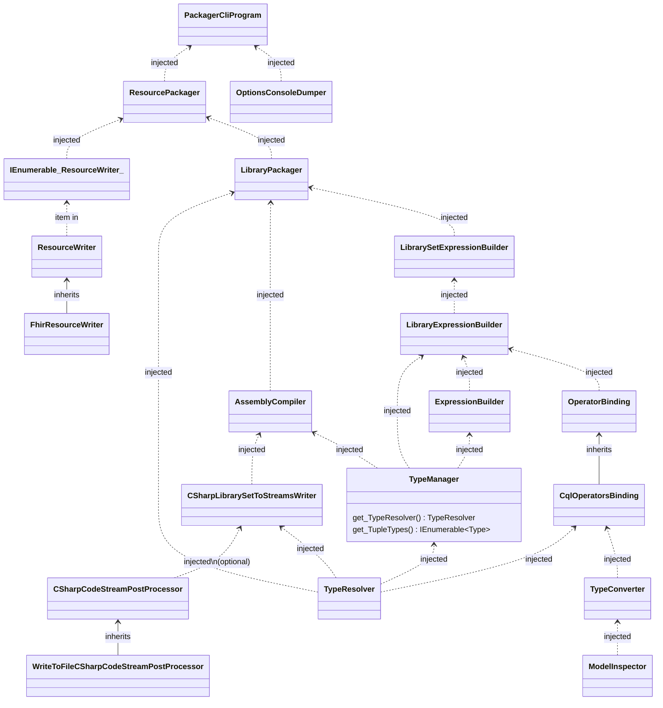
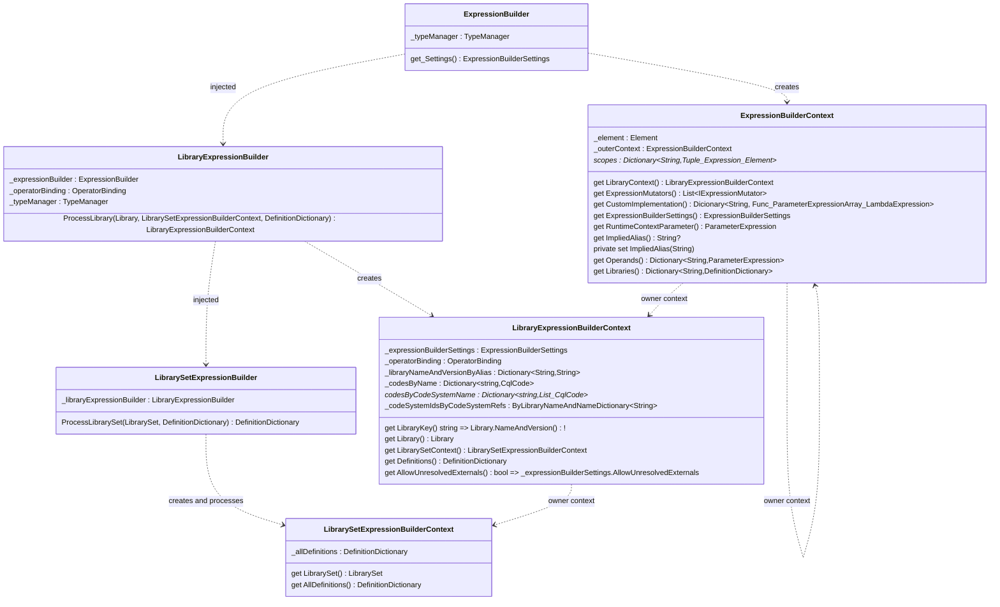

# PackagerCLI

## Service Dependencies (excl Logger and Options)

```mermaid
classDiagram
    direction BT

    %% HACK: Mermaid doesnt support commas withing generic, so use a similar looking character (ï¹)

    class TypeManager {
        get_TypeResolver() TypeResolver
        get_TupleTypes() IEnumerable~Type~
    }

    subgraph Generating_CSharp_From_LibrarySet_AndDefinitions
        class CSharpLibrarySetToStreamsWriter {
        }

        class CSharpCodeStreamPostProcessor {
        }

        class WriteToFileCSharpCodeStreamPostProcessor {
        }
    end


    %% Inheritance  
    
    CqlOperatorsBinding --> OperatorBinding : inherits
    FhirResourceWriter --> ResourceWriter : inherits
    WriteToFileCSharpCodeStreamPostProcessor --> CSharpCodeStreamPostProcessor : inherits

    %% Injected Dependencies

    CSharpLibrarySetToStreamsWriter ..> AssemblyCompiler : injected
    TypeManager ..> AssemblyCompiler : injected

    TypeManager ..> ExpressionBuilder : injected

    ResourcePackager ..> PackagerCliProgram : injected 
    OptionsConsoleDumper ..> PackagerCliProgram : injected 
    
       
    TypeResolver ..> CqlOperatorsBinding : injected
    TypeConverter ..> CqlOperatorsBinding : injected

    ModelInspector ..> TypeConverter : injected  

    TypeResolver ..> TypeManager : injected

    TypeResolver ..> LibraryPackager : injected
    AssemblyCompiler ..> LibraryPackager : injected
    LibrarySetExpressionBuilder ..> LibraryPackager : injected
    
    CSharpCodeStreamPostProcessor ..> CSharpLibrarySetToStreamsWriter : injected\n(optional)
    TypeResolver ..> CSharpLibrarySetToStreamsWriter : injected

    TypeManager ..> LibraryExpressionBuilder : injected
    ExpressionBuilder ..> LibraryExpressionBuilder : injected
    OperatorBinding ..> LibraryExpressionBuilder : injected

    LibraryExpressionBuilder ..> LibrarySetExpressionBuilder : injected

    IEnumerable_ResourceWriter_ ..> ResourcePackager : injected 
    LibraryPackager ..> ResourcePackager : injected

    %% Rest
    ResourceWriter ..> IEnumerable_ResourceWriter_ : item in

```

## ExpressionBuilders and Contexts

```mermaid
classDiagram
    direction TD

    class LibrarySetExpressionBuilder {
       _libraryExpressionBuilder : LibraryExpressionBuilder

       ProcessLibrarySet(LibrarySet, DefinitionDictionary<LambdaExpression>) DefinitionDictionary<LambdaExpression>
    }

    class LibrarySetExpressionBuilderContext {
       _allDefinitions : DefinitionDictionary<LambdaExpression>

       get LibrarySet() LibrarySet
       get AllDefinitions() DefinitionDictionary<LambdaExpression>
    }

    class LibraryExpressionBuilder {
       _expressionBuilder : ExpressionBuilder
       _operatorBinding : OperatorBinding
       _typeManager : TypeManager

       ProcessLibrary(Library, LibrarySetExpressionBuilderContext, DefinitionDictionary<LambdaExpression>) LibraryExpressionBuilderContext
    }

    class LibraryExpressionBuilderContext {
       _expressionBuilderSettings : ExpressionBuilderSettings
       _operatorBinding : OperatorBinding
       _libraryNameAndVersionByAlias : Dictionary~String,String~
       _codesByName : Dictionary~string,CqlCode~
       _codesByCodeSystemName : Dictionary~string,List_CqlCode_~
       _codeSystemIdsByCodeSystemRefs : ByLibraryNameAndNameDictionary~String~

       get LibraryKey() string => Library.NameAndVersion()!
       get Library() Library
       get LibrarySetContext() LibrarySetExpressionBuilderContext
       get Definitions() DefinitionDictionary<LambdaExpression>
       get AllowUnresolvedExternals() bool => _expressionBuilderSettings.AllowUnresolvedExternals
    }

    class ExpressionBuilder {
        _typeManager : TypeManager
        get_Settings() ExpressionBuilderSettings
    }
    

    class ExpressionBuilderContext {
        _element : Element
        _outerContext : ExpressionBuilderContext
        _scopes : Dictionary~String,Tuple_Expression_Element_~

        get LibraryContext() LibraryExpressionBuilderContext
        get ExpressionMutators() List~IExpressionMutator~
        get CustomImplementation() Dicionary~String, Func_ParameterExpressionArray_LambdaExpression~
        get ExpressionBuilderSettings() ExpressionBuilderSettings
        get RuntimeContextParameter() ParameterExpression
        get ImpliedAlias() String?
        private set ImpliedAlias(String)
        get Operands() Dictionary~String,ParameterExpression~
        get Libraries() Dictionary~String,DefinitionDictionary<LambdaExpression>~

    }

    LibrarySetExpressionBuilder ..> LibrarySetExpressionBuilderContext : creates and processes
    LibraryExpressionBuilder ..> LibraryExpressionBuilderContext : creates
    ExpressionBuilder ..> ExpressionBuilderContext : creates

    ExpressionBuilder ..> LibraryExpressionBuilder : injected
    LibraryExpressionBuilder ..> LibrarySetExpressionBuilder : injected

    ExpressionBuilderContext ..> LibraryExpressionBuilderContext : owner context
    ExpressionBuilderContext ..> ExpressionBuilderContext : owner context
    LibraryExpressionBuilderContext ..> LibrarySetExpressionBuilderContext : owner context
```