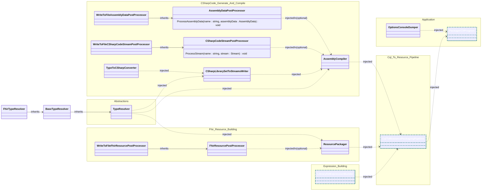

# PackagerCLI Diagrams
The diagram is split into two, the first one showing the high-level dependencies for the application, and the second the detailed dependencies for expression building.

### Application Dependencies (excl Logger and Options)

Remarks
* Cyan dotted outline classes indicate scoped services.
* All others are singleton services.

### Expression Builder Dependencies (excl Logger and Options)

