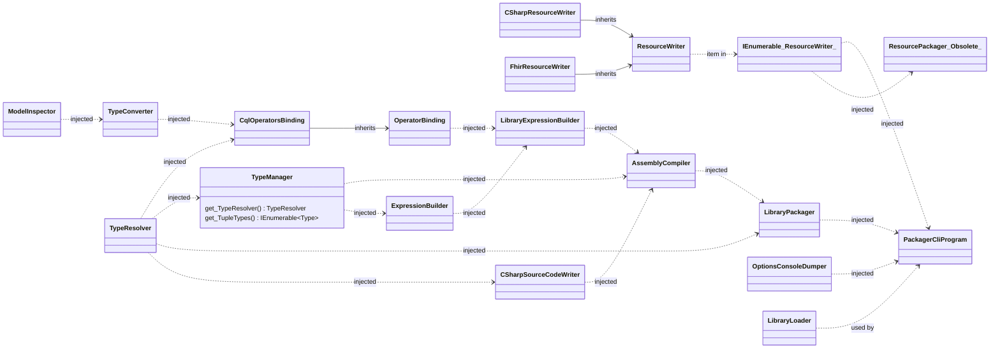

# PackagerCLI

## Service Dependencies (excl Logger and Options)

```mermaid
classDiagram
    direction LR

    class TypeManager {
        get_TypeResolver() TypeResolver
        get_TupleTypes() IEnumerable~Type~
    }

    %% HACK: Mermaid doesnt support commas withing generic, so use a similar looking character (ï¹)

    %% Inheritance  
    CqlOperatorsBinding --> OperatorBinding : inherits
    CSharpResourceWriter --> ResourceWriter : inherits
    FhirResourceWriter --> ResourceWriter : inherits

    %% Injected Dependencies
    LibraryExpressionBuilder ..> AssemblyCompiler : injected
    CSharpSourceCodeWriter ..> AssemblyCompiler : injected
    TypeManager ..> AssemblyCompiler : injected

    TypeManager ..> ExpressionBuilder : injected

    IEnumerable_ResourceWriter_ ..> PackagerCliProgram : injected 
    LibraryPackager ..> PackagerCliProgram : injected 
    OptionsConsoleDumper ..> PackagerCliProgram : injected 
    LibraryLoader ..> PackagerCliProgram : used by 

    TypeConverter ..> CqlOperatorsBinding : injected         
    TypeResolver ..> CqlOperatorsBinding : injected    

    ModelInspector ..> TypeConverter : injected  

    TypeResolver ..> TypeManager : injected

    TypeResolver ..> LibraryPackager : injected
    AssemblyCompiler ..> LibraryPackager : injected
    
    TypeResolver ..> CSharpSourceCodeWriter : injected

    ExpressionBuilder ..> LibraryExpressionBuilder : injected
    OperatorBinding ..> LibraryExpressionBuilder : injected

    %% Rest
    ResourceWriter ..> IEnumerable_ResourceWriter_ : item in

    %% Obsolete
    IEnumerable_ResourceWriter_ ..> ResourcePackager_Obsolete_ : injected 
```